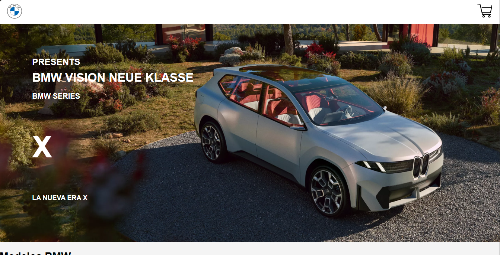

# 🚗 Proyecto HTML - Página de BMW  🖥️

Este es un proyecto Javascript que muestra una página funcional para un sitio web relacionado con BMW. Incluye una barra de navegación que enlaza a diferentes secciones y un apartado de carrito, Dentro de el carrito se almacenan los carros seleccionados previamente con la opcion de eliminarlos.

## 📄 Contenido

- **Barra de Navegación**: Permite navegar entre diferentes secciones como la página principal y la sección de carrito.
- **Vehiculos disponibles:** Permite visualizar todos los carros disponibles de BMW, precios y sus modelos.
- **NAV:** Permite filtrar los carros por su modelo

  

## 🛠️ Instalación

Para obtener una copia de este proyecto en tu máquina local, simplemente clona este repositorio utilizando Git:
````bash
git clone https://github.com/Nicolas-ruizg/proyectoHTML_Ruiz_Nicolas_Giraldo.git

````

## 🚀 Uso

-Abre el archivo `index.html` en tu navegador para ver la página principal del proyecto. Navega a través de la barra de navegación para explorar diferentes secciones.
- Utiliza la barra de búsqueda para encontrar productos específicos.
- Accede al carrito de compras para revisar y gestionar tus productos seleccionados.

## Foticos



  

## 🎉 Créditos

- Este proyecto fue creado por <strong> Nicolas Ruiz Giraldo </strong> 
- <strong> Email: </strong> nicorrugi@gmail.com

## 📝 Licencia

Este proyecto está bajo la licencia De mi Mamá .

